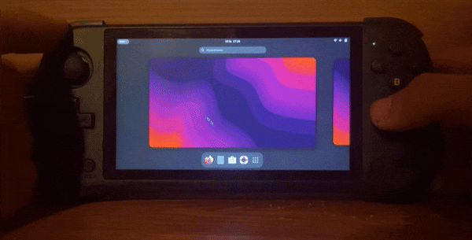
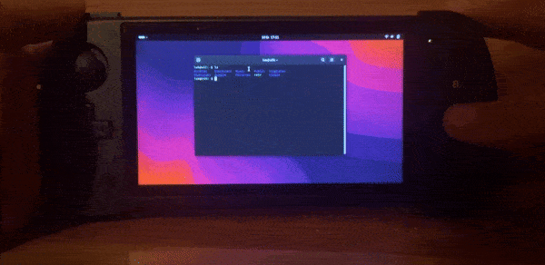
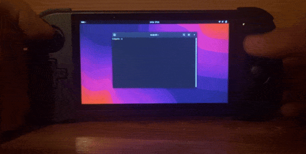

# Joypad x55

Let's you use x55 gamepad buttons and joysticks like keyboard and mouse

So you can use your x55 as desktop machine too

### Move your mouse


just use your right joystick

### Click


by using L1 and R2

### Type


_yes even type_

**Start and Select**
ctrl and alt

**D-Pad**
controlls arrows

**Left joystick + X/Y/A/B**

_this one is a bit complicated_

```
 Q | E | T
A W|D R|G Y
 S | F | H
-----------
 . | 1 | U 
5 ,|4 2|J I
 ? | 3 | K 
-----------
 N | Z | O 
/ M|Y X|L P
 ; | C | B 
```
_Note. numbers indicate special keys_

special keys:
1.  capslock
2.  space
3.  enter
4.  backspace
5.  meta/windows key

### toggling it

by pressing select and start at the same time you can enable and disable the mapper, usefull for playing games

have fun and share you feed back <3


#### Possibly asked questiones
_before creating issue_

**Q**: My layout is bad/not optimal?

**A**: ok? just edit a source code **yourself**, if you trully know the best layout and can stand by it being the default submit PR and elaborate

**Q**: Would this project work on other consols?

**A**: In theory, if you have soc console it might work out of the box but if it doesn't changing hardcoded
```cpp
inputDevice inabs("/dev/input/event1");//joysticks
inputDevice incon("/dev/input/event3");//buttons
```
in ```joypad.cpp``` to correct ones should fix the issue

otherwise you might need to slight rearrange the code, ```evtest``` should help with adjustments

_Remember. don't make issue about other devices not working_

**Q**: Will it work on regular gamepad?

**A**: It might, otherwise you need to adjust it (look question above)

**Q**: How do i build a package?

**A**: On debian install deps
```
sudo apt install build-essential libevdev-dev
```
and run **build-deb** script inside the repo

**Q**: Will it work on x86/64 architecture?

**A**: It should if you build it yourself, still might need adjustments (look above)

**Q**: Build for diffrent distro?

**A**: Do it yourself, analyze ```build-deb```, i won't object to PR

**Q**: How do i get Debian onto x55?

**A**: ask at rocknix discord or wait for [this project](https://github.com/hexdump0815/imagebuilder/issues/209?notification_referrer_id=NT_kwDOBYdcALQxMDUyNTQ3OTc1Mzo5Mjc1Njk5Mg#issuecomment-2460856466) to become reality

**Q**: apt repo?

**A**: Comming soon?